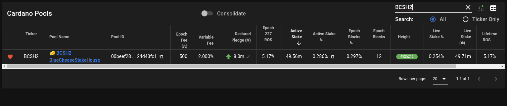

# cncli
A community-based cardano-node CLI tool. It's a collection of utilities to enhance and extend beyond those available with the `cardano-cli`

#### Contributors
CNCLI is provided free of charge to the Cardano Stakepool operator community. If you want to support its continued development, you can delegate or recommend the pools of our contributors.
 * Andrew Westberg - BCSH
 * Michael Fazio - SAND

## Building
#### Prepare RUST environment
```shell script
$ mkdir $HOME/.cargo && mkdir $HOME/.cargo/bin
$ chown -R $USER $HOME/.cargo
$ touch $HOME/.profile
$ chown $USER $HOME/.profile
```
#### Install rustup - proceed with default install (option 1)
```shell script
$ curl --proto '=https' --tlsv1.2 -sSf https://sh.rustup.rs | sh

# To configure your current shell run:
$ source $HOME/.cargo/env

$ rustup install stable
$ rustup default stable
$ rustup update
$ rustup component add clippy rustfmt
```
#### Install dependencies and build cncli
```shell script
$ source $HOME/.cargo/env
$ sudo apt-get update -y
$ sudo apt-get install -y automake build-essential pkg-config libffi-dev libgmp-dev libssl-dev libtinfo-dev libsystemd-dev zlib1g-dev make g++ tmux git jq wget libncursesw5 libtool autoconf
$ git clone --recurse-submodules https://github.com/AndrewWestberg/cncli
$ cd cncli
$ git checkout <latest_tag_name>
$ cargo install --path . --force      
$ cncli --version
```

## Contributing
Before submitting a pull request ensure that all tests pass, code is correctly formatted and linted, and that no common mistakes have been made, by running the following commands:
```shell script
$ cargo check
$ cargo fmt --all -- --check
$ cargo clippy -- -D warnings
```

## Updating cncli from earlier versions
```shell script
$ rustup update
$ cd cncli
$ git fetch --all --prune
$ git checkout <latest_tag_name>
$ cargo install --path . --force
$ cncli --version
```

## Running

### Ping Command
This command validates that the remote server is on the given network and returns its response time.
#### Show Help
```shell script
$ cncli ping --help
cncli-ping 0.1.0

USAGE:
    cncli ping [OPTIONS] --host <host>

FLAGS:
        --help       Prints help information
    -V, --version    Prints version information

OPTIONS:
    -h, --host <host>                      cardano-node hostname to connect to
        --network-magic <network-magic>    network magic. [default: 764824073]
    -p, --port <port>                      cardano-node port [default: 3001]
```
#### Example Mainnet ping using defaults
```shell script
$ cncli ping --host north-america.relays-new.cardano-mainnet.iohk.io                                 
{
 "status": "ok",
 "host": "north-america.relays-new.cardano-mainnet.iohk.io",
 "port": 3001,
 "connectDurationMs": 98,
 "durationMs": 118
}
```
#### Example Mainnet ping timeout failure
```shell script
$ cncli ping --host north-america.relays-new.cardano-mainnet.iohk.io --port 9999
{
 "status": "error",
 "host": "north-america.relays-new.cardano-mainnet.iohk.io",
 "port": 9999,
 "errorMessage": "Failed to connect: connection timed out"
}
```
#### Example ping to testnet node with mainnet magic failure
```shell script
$ cncli ping --host north-america.relays-new.cardano-testnet.iohkdev.io         
{
 "status": "error",
 "host": "north-america.relays-new.cardano-testnet.iohkdev.io",
 "port": 3001,
 "errorMessage": "version data mismatch: NodeToNodeVersionData {networkMagic = NetworkMagic {unNetworkMagic = 1097911063}, diffusionMode = InitiatorAndResponderDiffusionMode} /= NodeToNodeVersionData {networkMagic = NetworkMagic {unNetworkMagic = 764824073}, diffusionMode = InitiatorAndResponderDiffusionMode}"
}
```
#### Example ping to testnet success
```shell script
$ cncli ping --host north-america.relays-new.cardano-testnet.iohkdev.io --port 3001 --network-magic 1097911063
{
 "status": "ok",
 "host": "north-america.relays-new.cardano-testnet.iohkdev.io",
 "port": 3001,
 "connectDurationMs": 18,
 "durationMs": 38
}
```

### Sync Command
This command connects to a remote node and synchronizes blocks to a local sqlite database. The `validate` and `leaderlog` commands require a synchronized database.
#### Show Help
```shell script
$ cncli sync --help
cncli-sync 0.5.10

USAGE:
    cncli sync [FLAGS] [OPTIONS] --host <host>

FLAGS:
        --help          Prints help information
        --no-service    Exit at 100% sync'd.
    -V, --version       Prints version information

OPTIONS:
    -d, --db <db>                          sqlite database file [default: ./cncli.db]
    -h, --host <host>                      cardano-node hostname to connect to
        --network-magic <network-magic>    network magic. [default: 764824073]
    -p, --port <port>                      cardano-node port [default: 3001]
```

#### Example sync command
```shell script
$ cncli sync --host 127.0.0.1 --port 6000
 2020-10-31T16:55:35.025Z INFO  cncli::nodeclient > Starting NodeClient...
 2020-10-31T16:55:35.025Z INFO  cncli::nodeclient::protocols::mux_protocol > Connecting to 127.0.0.1:6000 ...
 2020-10-31T16:55:35.030Z WARN  cncli::nodeclient::protocols::handshake_protocol > HandshakeProtocol::State::Done
 2020-10-31T16:55:35.110Z WARN  cncli::nodeclient::protocols::transaction_protocol > TxSubmissionProtocol::State::Done
 2020-10-31T16:55:35.110Z WARN  cncli::nodeclient::protocols::chainsync_protocol   > rollback to slot: 4492799
 2020-10-31T16:55:35.114Z INFO  cncli::nodeclient::protocols::chainsync_protocol   > block 4490511 of 4891060, 91.81% synced
 2020-10-31T16:55:40.646Z INFO  cncli::nodeclient::protocols::chainsync_protocol   > block 4519089 of 4891061, 92.39% synced
 2020-10-31T16:55:46.341Z INFO  cncli::nodeclient::protocols::chainsync_protocol   > block 4544646 of 4891061, 92.92% synced
 2020-10-31T16:55:52.012Z INFO  cncli::nodeclient::protocols::chainsync_protocol   > block 4567647 of 4891061, 93.39% synced
 2020-10-31T16:55:57.815Z INFO  cncli::nodeclient::protocols::chainsync_protocol   > block 4594692 of 4891062, 93.94% synced
 2020-10-31T16:56:03.793Z INFO  cncli::nodeclient::protocols::chainsync_protocol   > block 4624024 of 4891063, 94.54% synced
 2020-10-31T16:56:09.814Z INFO  cncli::nodeclient::protocols::chainsync_protocol   > block 4653024 of 4891063, 95.13% synced
 2020-10-31T16:56:15.808Z INFO  cncli::nodeclient::protocols::chainsync_protocol   > block 4678390 of 4891063, 95.65% synced
 2020-10-31T16:56:21.856Z INFO  cncli::nodeclient::protocols::chainsync_protocol   > block 4704799 of 4891063, 96.19% synced
 2020-10-31T16:56:27.887Z INFO  cncli::nodeclient::protocols::chainsync_protocol   > block 4730288 of 4891063, 96.71% synced
 2020-10-31T16:56:34.167Z INFO  cncli::nodeclient::protocols::chainsync_protocol   > block 4756308 of 4891063, 97.24% synced
 2020-10-31T16:56:40.340Z INFO  cncli::nodeclient::protocols::chainsync_protocol   > block 4782723 of 4891064, 97.78% synced
 2020-10-31T16:56:46.448Z INFO  cncli::nodeclient::protocols::chainsync_protocol   > block 4806428 of 4891064, 98.27% synced
 2020-10-31T16:56:52.675Z INFO  cncli::nodeclient::protocols::chainsync_protocol   > block 4831364 of 4891064, 98.78% synced
 2020-10-31T16:56:59.101Z INFO  cncli::nodeclient::protocols::chainsync_protocol   > block 4863279 of 4891065, 99.43% synced
 2020-10-31T16:57:05.576Z INFO  cncli::nodeclient::protocols::chainsync_protocol   > block 4889661 of 4891065, 99.97% synced
 2020-10-31T16:57:17.958Z INFO  cncli::nodeclient::protocols::chainsync_protocol   > block 4891066 of 4891066, 100.00% synced
 2020-10-31T16:57:30.927Z INFO  cncli::nodeclient::protocols::chainsync_protocol   > block 4891067 of 4891067, 100.00% synced
```
### Status Command
This simple command gives you an ok if the database is fully synced. It will return a status of error if not.
#### Show Help
```shell script
$ cncli status --help
cncli-status 0.2.5

USAGE:
    cncli status [OPTIONS] --byron-genesis <byron-genesis> --shelley-genesis <shelley-genesis>

FLAGS:
    -h, --help       Prints help information
    -V, --version    Prints version information

OPTIONS:
        --byron-genesis <byron-genesis>        byron genesis json file
    -d, --db <db>                              sqlite database file [default: ./cncli.db]
        --shelley-genesis <shelley-genesis>    shelley genesis json file
``` 

#### Status when fully synced
```shell script
$ cncli status --byron-genesis ~/haskell/local/byron-genesis.json --shelley-genesis ~/haskell/local/shelley-genesis.json              
{
 "status": "ok"
}
```

#### Status when not fully synced
```shell script
$ cncli status --byron-genesis ~/haskell/local/byron-genesis.json --shelley-genesis ~/haskell/local/shelley-genesis.json --db dummy.db
{
 "status": "error",
 "errorMessage": "db not fully synced!"
}
```

### Validate Command
This command validates that a block hash or partial block hash is on-chain. You must run `sync` command separately to build up the database and have it sync to 100%.
#### Show Help
```shell script
$ cncli validate --help
cncli-validate 0.1.0

USAGE:
    cncli validate [OPTIONS] --hash <hash>

FLAGS:
    -h, --help       Prints help information
    -V, --version    Prints version information

OPTIONS:
    -d, --db <db>        sqlite database file [default: ./cncli.db]
        --hash <hash>    full or partial block hash to validate
```

#### Validate block success
```shell script
$ cncli validate --hash 0c4b73
{
 "status": "ok",
 "block_number": "4891104",
 "slot_number": "12597768",
 "hash": "0c4b730183ab2533d423f9af56ed99efd8121f716f82aa95caa3e6c11f10dc8d",
 "prev_hash": "2142685e0912f1956c99551431270c1e199b85cde57fe56554d23ce111504fe9",
 "leader_vrf": "000111925d12aea26b1705ef244fe8930f437be294180b418fba47ebf386e73d5ec7bbd397df5ba44d085171a66266089fba10a089442e207d7ad730849f9293"
}
```

#### Validate block orphaned
```shell script
$ cncli validate --hash af6d8e
{
 "status": "orphaned",
 "block_number": "4891104",
 "slot_number": "12597768",
 "hash": "af6d8e8a21bd65b6542fecc51da82e59824ad51c43fb2bbc0dcd0c8f20f2adae",
 "prev_hash": "2142685e0912f1956c99551431270c1e199b85cde57fe56554d23ce111504fe9",
 "leader_vrf": "000c6abd406175af91def3c225fb758370d26e506275a9574eb88ebb886490f3a4a6d971c822193bb3a186b8c3d75c890f61bff09fbf7f0066b152a2707f9929"
}
```

#### Validate block missing
```shell script
$ cncli validate --hash ffffff
{
 "status": "error",
 "errorMessage": "Query returned no rows"
}
```
### Nonce Command
This command calculates the epoch nonce value.

This command requires that you:

1.) Use the `sync` command above to build a 100% sync'd cncli.db database file.

#### Show Help
```shell script
$ cncli nonce --help
cncli-nonce 0.2.7

USAGE:
    cncli nonce [OPTIONS] --byron-genesis <byron-genesis> --shelley-genesis <shelley-genesis>

FLAGS:
    -h, --help       Prints help information
    -V, --version    Prints version information

OPTIONS:
        --byron-genesis <byron-genesis>        byron genesis json file
    -d, --db <db>                              sqlite database file [default: ./cncli.db]
        --ledger-set <ledger-set>              Which ledger data to use. prev - previous epoch, current - current epoch,
                                               next - future epoch [default: current]
        --shelley-genesis <shelley-genesis>    shelley genesis json file
```

#### Calculate nonce
```shell script
$ cncli nonce --byron-genesis ~/haskell/test/byron-genesis.json --shelley-genesis ~/haskell/test/shelley-genesis.json --ledger-set next
60d68963ece4f16a30934f473fc3be51526f7c6ff2ac0b3f8a40a38623411f8e
```

### Leaderlog Command
This command calculates a stakepool's expected slot list. "prev" and "current" logs are available as long as you have a sync'd database. "next" logs are only available 1.5 days before the end of the epoch.

This command requires that you:

1.) use cardano-cli to dump a fresh ledger-state.json file 
```shell script
$ cardano-cli query ledger-state --cardano-mode --allegra-era --mainnet > /tmp/ledger-state-227.json
```
2.) Use the `sync` command above to build a 100% sync'd cncli.db database file.

#### Show Help
```shell script
$ cncli leaderlog --help
cncli-leaderlog 0.2.4

USAGE:
    cncli leaderlog [OPTIONS] --byron-genesis <byron-genesis> --ledger-state <ledger-state> --pool-id <pool-id> --pool-vrf-skey <pool-vrf-skey> --shelley-genesis <shelley-genesis>

FLAGS:
    -h, --help       Prints help information
    -V, --version    Prints version information

OPTIONS:
        --byron-genesis <byron-genesis>        byron genesis json file
    -d, --db <db>                              sqlite database file [default: ./cncli.db]
        --ledger-set <ledger-set>              Which ledger data to use. prev - previous epoch, current - current epoch,
                                               next - future epoch [default: current]
        --ledger-state <ledger-state>          ledger state json file
        --pool-id <pool-id>                    lower-case hex pool id
        --pool-vrf-skey <pool-vrf-skey>        pool's vrf.skey file
        --shelley-genesis <shelley-genesis>    shelley genesis json file
        --tz <timezone>                        TimeZone string from the IANA database -
                                               https://en.wikipedia.org/wiki/List_of_tz_database_time_zones [default:
                                               America/Los_Angeles]
```

#### Calculate leaderlog
```shell script
$ cncli leaderlog --pool-id 00beef284975ef87856c1343f6bf50172253177fdebc756524d43fc1 --pool-vrf-skey ./bcsh2.vrf.skey --byron-genesis ~/haskell/local/byron-genesis.json --shelley-genesis ~/haskell/local/shelley-genesis.json --ledger-state /tmp/ledger-state-227.json --ledger-set current
{
  "status": "ok",
  "epoch": 227,
  "epochNonce": "0e534dd41bb80bfff4a16d038eb52280e9beac7545cc32c9bfc253a6d92010d1",
  "poolId": "00beef284975ef87856c1343f6bf50172253177fdebc756524d43fc1",
  "sigma": 0.0028306163817569175,
  "d": 0.5,
  "assignedSlots": [
    ...
    {
      "slot": 13083245,
      "slotInEpoch": 382445,
      "at": "2020-11-05T23:58:56-08:00"
    },
    {
      "slot": 13106185,
      "slotInEpoch": 405385,
      "at": "2020-11-06T06:21:16-08:00"
    }
    ...
  ]
}
```

#### Calculate leaderlog failure (too soon for "next" logs, or un-sync'd database)
```shell script
$ cncli leaderlog --pool-id 00beef284975ef87856c1343f6bf50172253177fdebc756524d43fc1 --pool-vrf-skey ./bcsh2.vrf.skey --byron-genesis ~/haskell/local/byron-genesis.json --shelley-genesis ~/haskell/local/shelley-genesis.json --ledger-state /tmp/ledger-state-227.json --ledger-set next
{
 "status": "error",
 "errorMessage": "Query returned no rows"
}
```

### Sendtip command
The sendtip command is used to communicate with [pooltool.io](https://pooltool.io) so you can have a green badge on their website with your current tip height.


It is important to point this command at your core nodes. This will help pooltool capture any orphan blocks. There is no guarantee that an orphan block you make will be seen by pooltool. Pointing to your core nodes should help with that.

#### Sendtip help
```shell script
$ cncli sendtip --help          
cncli-sendtip 0.2.2

USAGE:
    cncli sendtip [OPTIONS] --cardano-node <cardano-node>

FLAGS:
    -h, --help       Prints help information
    -V, --version    Prints version information

OPTIONS:
        --cardano-node <cardano-node>    path to cardano-node executable for gathering version info
        --config <config>                pooltool config file for sending tips [default: ./pooltool.json]
```

#### Configuring pooltool.json
You need to create a pooltool.json file so that the sendtip command knows what node(s) to connect to. It also contains your pooltool configuration. Your pooltool api key can be found on your pooltool profile page.

```json
{
  "api_key": "a47811d3-0008-4ecd-9f3e-9c22bdb7c82d",
  "pools": [
    ...
  	{
  		"name": "TCKR",
  		"pool_id": "a7398d649be2f6d897ed24a613cf547bb20cd282a04edfc53d477114",
  		"host" : "123.123.123.12",
  		"port": 3001
  	},
  	{
  		"name": "TCKR1",
  		"pool_id": "b73d891285526062d41cd7293746048c6a9a13ab8b591920cf40c706",
  		"host" : "123.123.123.35",
  		"port": 3001
  	},
    ...
  ]
}
```

#### Sending tips to pooltool
```shell script
$ cncli sendtip --cardano-node /home/westbam/.local/bin/cardano-node --config pooltool.json
 2020-11-08T18:37:52.323Z INFO  cncli::nodeclient::protocols::mux_protocol > Connecting to 123.123.123.12:3001
 2020-11-08T18:37:52.358Z WARN  cncli::nodeclient::protocols::transaction_protocol > TxSubmissionProtocol::State::Done
 2020-11-08T18:37:52.358Z WARN  cncli::nodeclient::protocols::chainsync_protocol   > rollback to slot: 4492799
 2020-11-08T18:37:52.359Z WARN  cncli::nodeclient::protocols::chainsync_protocol   > rollback to slot: 13294373
 2020-11-08T18:37:54.402Z INFO  cncli::nodeclient::protocols::chainsync_protocol   > Pooltool (TCKR, a7398d64): (4925270, 4d65b09dc1d5c6c2), json: {"success":true,"message":null}
 2020-11-08T18:38:36.323Z INFO  cncli::nodeclient::protocols::chainsync_protocol   > Pooltool (TCKR, a7398d64): (4925271, 47d6beb189f24c9e), json: {"success":true,"message":null}
 2020-11-08T18:38:37.424Z INFO  cncli::nodeclient::protocols::chainsync_protocol   > Pooltool (TCKR, a7398d64): (4925272, defe4ba88985c305), json: {"success":true,"message":null}
 ...
 ...
```

### Sendslots command
The sendslots command securely sends pooltool the number of slots you have assigned for an epoch and validates the correctness of your past epochs. You must have a sync'd database and have calculated leaderlogs for every pool in pooltool.json before calling this command. It should be called within the first 10 minutes of the epoch cutover.

#### Sendslots help
```shell script
$ cncli sendslots --help
cncli-sendslots 0.3.1

USAGE:
    cncli sendslots [OPTIONS] --byron-genesis <byron-genesis> --shelley-genesis <shelley-genesis>

FLAGS:
    -h, --help       Prints help information
    -V, --version    Prints version information

OPTIONS:
        --byron-genesis <byron-genesis>        byron genesis json file
        --config <config>                      pooltool config file for sending slots [default: ./pooltool.json]
    -d, --db <db>                              sqlite database file [default: ./cncli.db]
        --shelley-genesis <shelley-genesis>    shelley genesis json file
```

#### Sendslots success
```
$ cncli sendslots --byron-genesis ~/haskell/local/byron-genesis.json --shelley-genesis ~/haskell/local/shelley-genesis.json
 2020-12-01T03:34:33.883Z INFO  cncli::nodeclient::leaderlog > Sending: {"apiKey":"d67822d0-0008-4eb5-9e1e-9c30bdb8d82d","poolId":"00beef0a9be2f6d897ed24a613cf547bb20cd282a04edfc53d477114","epoch":232,"slotQty":25,"hash":"d15b6c8d4c81fe48cff0650c5b59ab20da9765374c58c933dacd058eb38bb670"}
 2020-12-01T03:34:33.969Z INFO  cncli::nodeclient::leaderlog > Pooltool Response: {"statusCode":200,"headers":{"Content-Type":"application/json","Access-Control-Allow-Origin":"*"},"body":"{\"success\":true,\"message\":\"We have updated your assigned slots for epoch 232 to be 25 with a hash of d15b6c8d4c81fe48cff0650c5b59ab20da9765374c58c933dacd058eb38bb670.  You must provide an array of slots that matches this hash to have your performance counted.\"}"}
 2020-12-01T03:34:33.971Z INFO  cncli::nodeclient::leaderlog > Sending: {"apiKey":"d67822d0-0008-4eb5-9e1e-9c30bdb8d82d","poolId":"00beef8710427e328a29555283c74b202b40bec9a62630a9f03b1e18","epoch":232,"slotQty":24,"hash":"97655646efcfe8a569508d70e6fc46135488fc5600bb95233c3f005106a7f5a3"}
 2020-12-01T03:34:34.051Z INFO  cncli::nodeclient::leaderlog > Pooltool Response: {"statusCode":200,"headers":{"Content-Type":"application/json","Access-Control-Allow-Origin":"*"},"body":"{\"success\":true,\"message\":\"We have updated your assigned slots for epoch 232 to be 24 with a hash of 97655646efcfe8a569508d70e6fc46135488fc5600bb95233c3f005106a7f5a3.  You must provide an array of slots that matches this hash to have your performance counted.\"}"}
 2020-12-01T03:34:34.053Z INFO  cncli::nodeclient::leaderlog > Sending: {"apiKey":"d67822d0-0008-4eb5-9e1e-9c30bdb8d82d","poolId":"00beef9385526062d41cd7293746048c6a9a13ab8b591920cf40c706","epoch":232,"slotQty":54,"hash":"f12dff6eb3786d04cb2d7f666e92876faa7d5f2a26de77d3affc1aaffa6d81a5"}
 2020-12-01T03:34:34.149Z INFO  cncli::nodeclient::leaderlog > Pooltool Response: {"statusCode":200,"headers":{"Content-Type":"application/json","Access-Control-Allow-Origin":"*"},"body":"{\"success\":true,\"message\":\"We have updated your assigned slots for epoch 232 to be 54 with a hash of f12dff6eb3786d04cb2d7f666e92876faa7d5f2a26de77d3affc1aaffa6d81a5.  You must provide an array of slots that matches this hash to have your performance counted.\"}"}
 2020-12-01T03:34:34.150Z INFO  cncli::nodeclient::leaderlog > Sending: {"apiKey":"d67822d0-0008-4eb5-9e1e-9c30bdb8d82d","poolId":"00beef284975ef87856c1343f6bf50172253177fdebc756524d43fc1","epoch":232,"slotQty":42,"hash":"30c92d028c99af5ca51dd58293a575b14671d56cd6c846bd1c21126a2addd9ac"}
 2020-12-01T03:34:34.222Z INFO  cncli::nodeclient::leaderlog > Pooltool Response: {"statusCode":200,"headers":{"Content-Type":"application/json","Access-Control-Allow-Origin":"*"},"body":"{\"success\":true,\"message\":\"We have updated your assigned slots for epoch 232 to be 42 with a hash of 30c92d028c99af5ca51dd58293a575b14671d56cd6c846bd1c21126a2addd9ac.  You must provide an array of slots that matches this hash to have your performance counted.\"}"}
```


### systemd scripts
`sync` and `sendtip` can be easily enabled as systemd services. Here are some example configurations.

```shell script
$ cat /etc/systemd/system/cncli-sync.service 
[Unit]
Description=cncli sync
After=syslog.target
StartLimitIntervalSec=0

[Service]
Type=simple
Restart=always
RestartSec=5
User=westbam
LimitNOFILE=131072
WorkingDirectory=/home/westbam/Development/cncli
ExecStart=/home/westbam/.cargo/bin/cncli sync --host 127.0.0.1 --port 6000 --db /home/westbam/Development/cncli/cncli.db
SuccessExitStatus=143
StandardOutput=syslog
StandardError=syslog
SyslogIdentifier=cncli-sync
                
[Install]
WantedBy=multi-user.target
```

```shell script
$ cat /etc/systemd/system/cncli-sendtip.service 
[Unit]
Description=cncli sendtip
After=syslog.target
StartLimitIntervalSec=0

[Service]
Type=simple
Restart=always
RestartSec=5
User=westbam
LimitNOFILE=131072
WorkingDirectory=/home/westbam/Development/cncli
ExecStart=/home/westbam/.cargo/bin/cncli sendtip --cardano-node /home/westbam/.local/bin/cardano-node --config /home/westbam/Development/cncli/pooltool.json
SuccessExitStatus=143
StandardOutput=syslog
StandardError=syslog
SyslogIdentifier=cncli-sendtip
                
[Install]
WantedBy=multi-user.target
```
